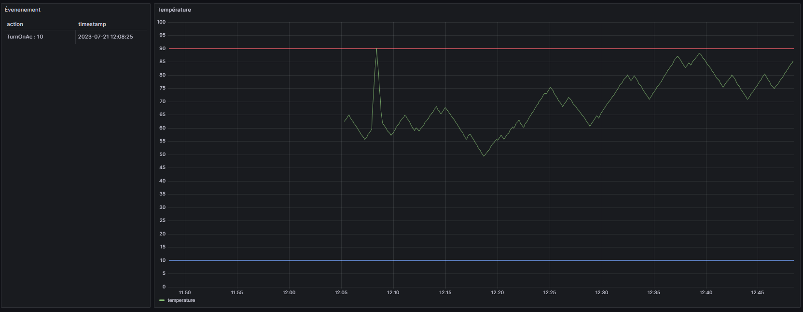

# Grafana Oxygen-Cs

Pour le projet Oxygen-Cs, nous avons décidé d'ajouter deux éléments à notre interface Grafana : une table et un graphique.

## Tableau des événements

Le tableau présente chaque événement de la simulation. On peut ainsi observer chaque instance où un événement de type "TurnOnAc" ou "TurnOnHeater" est effectué. Cette table nous permet d'avoir une vue d'ensemble des actions qui ont été prises pendant la simulation.

## Graphique de la variance de température

Nous avons également inclus un graphique qui représente la variance de température en fonction du temps. Ceci nous permet de mieux visualiser les fluctuations de la température au cours de la simulation. Le graphique affiche aussi deux lignes distinctes : l'une représente la température maximale et l'autre représente la température minimale. Ces deux lignes permettent de visualiser clairement les variations de température au fil du temps.

